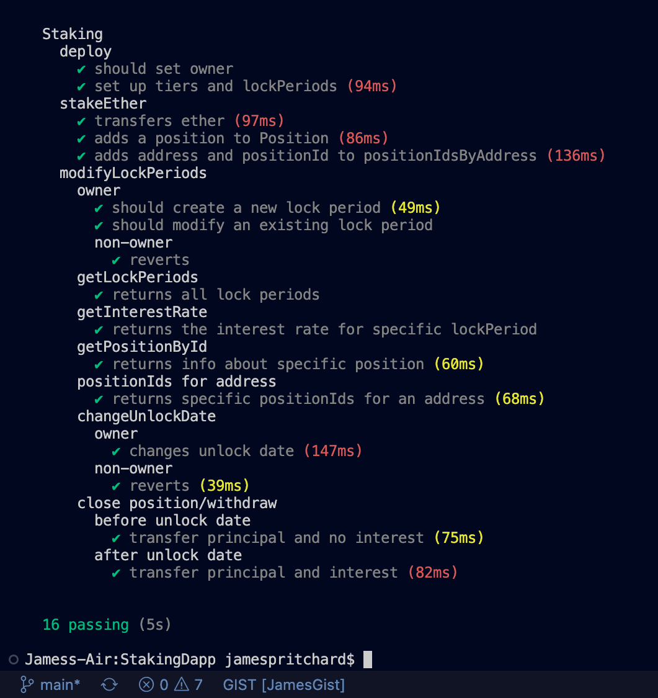

# Ethereum Staking dApp

### Description
This dApp allows users to stake ETH and earn interest. Users lock in for a specific timeframe and only recieve interest if withdrawn after unlock date has past

### Contributions
[Issues and Pull requests can be made to this repo](https://github.com/SuedePritch/StakingDapp)

### Technology
* Solidity
* React
* Ethers
* Chai
* Hardhat 

### Testing
run unit tests

    npx hardhat test

